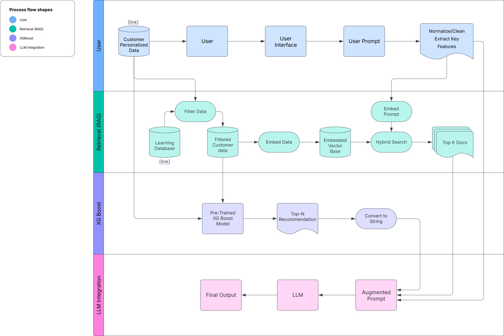

# CinemaRAG 🎬

CinemaRAG is a retrieval-augmented movie recommendation system that combines hybrid search with Weaviate, XGBoost ranking, and a final LLM reasoning layer.

- Retriever → performs hybrid semantic + keyword search over a movie database (plots, genres, metadata).

- Ranker (XGBoost) → scores candidate movies using engineered features (retrieval scores, metadata signals).

- LLM layer → refines results, adds natural-language explanations, and personalizes recommendations.

- User Interface → lightweight API/UI for querying (e.g., “recommend me a sci-fi movie with time travel”).

- The project demonstrates how to integrate vector databases, ML models, and LLMs into a clean modular pipeline for professional RAG applications.

## CinemaRAG Workflow Diagram



The CinemaRAG workflow starts with user input, which is cleaned and embedded for retrieval. A hybrid search over the vector database surfaces the most relevant documents. These results are combined with recommendations from an XGBoost model and formatted into an augmented prompt. Finally, the LLM generates the output response, tailored to the user’s preferences.


## 🚀 Setup

Make sure you are using Python 3.10 (recommended for best compatibility). You can create a conda environment first:

### Create Conda Setup
```Bash
conda create -n {ENV_NAME} python=3.11 -y
conda activate {ENV_NAME}
```

### Install dependencies:
```Bash
git clone https://github.com/your-username/cinemarag.git
cd cinemarag
```
##### Pip Install Pytorch
```Bash
pip install torch torchvision torchaudio --index-url https://download.pytorch.org/whl/cu121
```
##### Pip install Huggingface Stack
```Bash
pip install "transformers==4.45.1" accelerate==0.29.3 safetensors>=0.4.3 huggingface_hub>=0.23 bitsandbytes
```
##### Rebuild Nemotron's Custom Ops
```bash
export TORCH_CUDA_ARCH_LIST="8.6"   # RTX 3080 Ti
export TORCH_CUDA_ARCH_LIST="8.9"   # RTX 4070 Ti

pip install --no-build-isolation --no-cache-dir \
causal-conv1d==1.5.2 mamba-ssm==2.2.5
```

##### Pip Install CinemaRAG dependencies
```Bash
pip install -r requirements.txt
```

##### Test Torch and Mamba Setup
```bash
python -c "import torch; print(torch.__version__, torch.version.cuda)"
python -c "import mamba_ssm, causal_conv1d; print('✅ Mamba stack OK')"
```

## Managing Docker

Build containers with docker-compose.yaml
```Bash & Start
sudo docker-compose -f docker/docker-compose.yml up --build -d
```
Stop & Remove Containers
```Bash
sudo docker-compose -f docker/docker-compose.yml down
```
View Logs
```Bash
sudo docker-compose -f docker/docker-compose.yml logs -f
```


## 🗂️ WorkFlow Hierarchy


```Bash
project/
├─ main.py                 # Entry point – wires together pipeline
├─ pyproject.toml          # Project metadata & dependencies
├─ README.md               # Project description & setup guide
├─ configs/                # YAML/JSON configs for retriever, models, logging
│  └─ config.yaml
├─ utils/                  # Core modules
│  ├─ common/              # Shared utilities (logging, config loaders, types)
│  ├─ ui/                  # User interface layer (FastAPI, Streamlit, etc.)
│  ├─ retriever/           # Retriever logic (Weaviate client, hybrid search)
│  ├─ features/            # Feature engineering for XGBoost
│  ├─ models/              # XGBoost + LLM wrappers
│  └─ pipelines/           # Orchestration of retriever → ranker → LLM
├─ tests/                  # Unit tests for each module
├─ data/                   # Raw & processed datasets (gitignored)
│  ├─ raw/
│  └─ processed/
└─ models_store/           # Saved ML models / embeddings (gitignored)
```

## Contributors
- Derick-Louie Trinidad (maintainer)
- Chelsey Toribio (collaborator)
